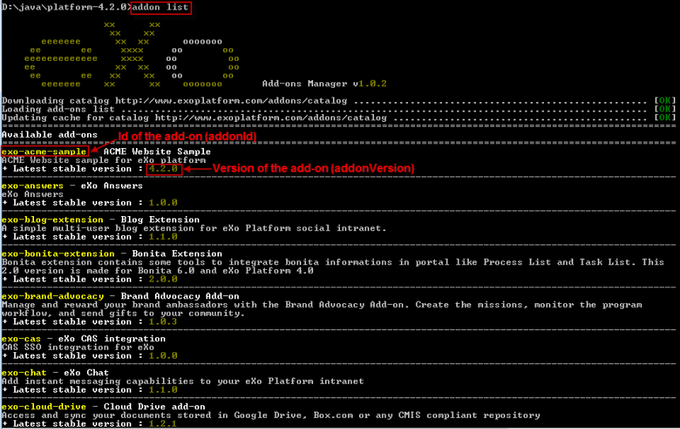

.. _eXo_addons:

##################
Add-ons Management
##################

    An add-on could be a set of extensions, customizations, xml
    configurations, applications, templates or any new services packaged
    in a zip archive. In other words, an add-on could be whatever that
    extends eXo Platform capabilities by adding services, resources, and
    more.

    The easiest way to manage add-ons is to use the eXo Add-ons Manager
    that is shipped by default in all 4.3 editions. The eXo Add-ons
    Manager defines a standard approach of packaging,
    installing/uninstalling and updating the available add-ons. With the
    eXo Add-ons Manager, you, as administrators, can enhance your
    management of the add-ons installed on the eXo Platform instances via the
    Command Line Interface (known as CLI), in a simple manner.

    Basically, start with the launch scripts:

    -  ``$PLATFORM_HOME/addon`` (Windows, Linux / Mac OX)

    -  ``$PLATFORM_HOME/addon.bat`` (Windows)

    When running the ``addon`` script only, you can view different sets
    of commands, arguments and options. The global syntax is in the
    format ``addon [command] [arguments] [options]``, where:

    -  [command] is either of: *list, install, uninstall, describe*.

    -  [arguments] are ones specific to an add-on (Id and version).

    -  [options] are switch options that can be global or specific to
       the command (started with **--** or **-**).

    Also, you could add the following useful options:

    -  ``--help / -h`` - Views all the needed information of the command
       line program.

    -  ``--verbose / -v`` - Prints the verbose log for
       debugging/diagnostic purpose.

    By walking through the following topics in this chapter, you will
    know how to manage add-ons in eXo Platform via the CLI:

    -  :ref:`Listing add-ons <AddonsManagement.Listing>`

    -  :ref:`Describing add-ons <AddonsManagement.Describing>`

    -  :ref:`Installing/Uninstalling add-ons <AddonsManagement.InstallingUninstalling>`

    -  :ref:`Installing/Uninstalling add-ons in a docker container <AddonsManagement.InstallingUninstallingInDocker>`

.. _AddonsManagement.Listing:

===============
Listing add-ons
===============

Use the ``list`` command to view add-ons of the catalog and their needed
information (Id and versions).

::

    addon list [--snapshots] [--unstable] [--installed] [--outdated] [--catalog=$URL] [--no-cache] [--offline] [--verbose] [--batch-mode]

|image0|

With the ``addon list`` command (without any options), only add-ons that
have **at least one stable version** are displayed. And for each listed
add-on, only **the last stable version** is displayed.

Also, add the following options:

+-----------------------+----------------------------------------------------+
| ``--snapshots``       | Displays add-ons that have stable or development   |
|                       | versions. For each listed add-on, only the last    |
|                       | stable and the last development versions are       |
|                       | displayed.                                         |
+-----------------------+----------------------------------------------------+
| ``--unstable``        | Displays add-ons that have stable or unstable      |
|                       | versions. For each listed add-on, only the last    |
|                       | stable and the last unstable versions are          |
|                       | displayed.                                         |
+-----------------------+----------------------------------------------------+
| ``--installed``       | Displays add-ons (including stable and development |
|                       | versions) that are already installed in eXo 		 |
|                       | Platform.   										 |
+-----------------------+----------------------------------------------------+
| ``--outdated``        | Displays stable add-ons that have newer versions   |
|                       | than ones installed in eXo Platform - based on the |
|                       | `aether generic version                            |
|                       | order <http://download.eclipse.org/aether/aether-c |
|                       | ore/0.9.0.M2/apidocs/org/eclipse/aether/util/versi |
|                       | on/GenericVersionScheme.html>`__.                  |
+-----------------------+----------------------------------------------------+
| ``--no-cache``        | Displays add-ons by re-downloading the `remote     |
|                       | catalog <http://www.exoplatform.com/addons/catalog |
|                       | >`__.                                              |
+-----------------------+----------------------------------------------------+
| ``--offline``         | Displays add-ons by the cached and local catalogs  |
|                       | (without the network access).                      |
+-----------------------+----------------------------------------------------+
| ``--catalog=$URL``    | Displays add-ons by a remote catalog URL where URL |
|                       | is an alternative location for the catalog (for    |
|                       | example, http://example.org/remote.json).          |
+-----------------------+----------------------------------------------------+
| ``--no-compat``       | Displays add-ons that ignores the compatibility    |
|                       | check of application servers, editions and version |
|                       | range (corresponding to                            |
|                       | *supportedApplicationServers*,                     |
|                       | *supportedDistributions* and *compatibility*       |
|                       | respectively in each catalog entry).               |
+-----------------------+----------------------------------------------------+
| ``--batch-mode``      | Displays add-ons without the ASCII art logo (eXo   |
|                       | art text displayed right after the command on the  |
|                       | CLI).                                              |
+-----------------------+----------------------------------------------------+

